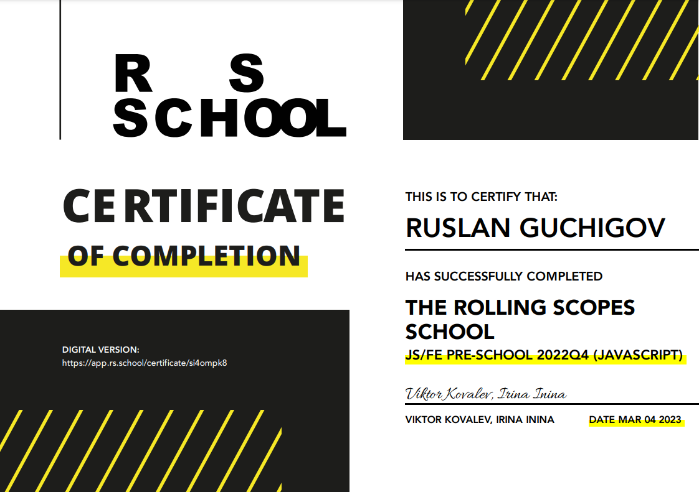

# Ruslan Guchigov
Future Frontend Developer

---

## 📫 Contacts
[telegram](https://t.me/guch1g0v),  [discord](https://discordapp.com/users/578533824586317834),  email: guchigow@yandex.kz

---
## ℹ️ Info
I’m currently study at [Rolling Scopes School](https://app.rs.school/). 

But I don't want to stop at just the web development. 

Long-term goal is to be great programmer and be proficient in several programming languages.

---

## 💻 My technologies 
* html5, css, scss, less, bootstrap 
* basic knowledge about C, basic js
* linux, vim, bash 
* git, github 
* photoshop, figma

---

## ⌨️ Me at [Codewars](https://www.codewars.com/users/lanov64)


Example simple js code:
```
function validParentheses(parens) {
    let open, close;
    close = open = 0;
    for(let i = 0; i < parens.length; i++) {
        if(open < close) return false;
        if(parens[i] === "(") open++;
        if(parens[i] === ")") close++;
    }
    return open === close;
}
```
---
## 👨‍🎓 Education:
+ [RS School «JavaScript/Front-end. Stage 0»](https://rs.school/js-stage0/)
 [pdf](https://app.rs.school/certificate/si4ompk8)
+ 📚 Books:
  * [Head First HTML and CSS: A Learner's Guide to Creating Standards-Based Web Pages](https://www.amazon.com/Head-First-HTML-CSS-Standards-Based-dp-0596159900/dp/0596159900/ref=dp_ob_title_bk)
  * [JavaScript for Kids: A Playful Introduction to Programming](https://www.amazon.com/JavaScript-Kids-Playful-Introduction-Programming/dp/1593274084/ref=sr_1_1?crid=14SOE3E838OX0&keywords=js+for+kids&qid=1670682051&s=books&sprefix=js+for+kid%2Cstripbooks-intl-ship%2C245&sr=1-1)
  * [Программирование: введение в профессию. Издание изд-ва ДМК Пресс, 2021 г.](http://stolyarov.info/books/programming_intro/dmk)
+ 🚀 [Course on youtube React Js](https://www.youtube.com/playlist?list=PLcvhF2Wqh7DNVy1OCUpG3i5lyxyBWhGZ8)

---

## English
About at A2 level
